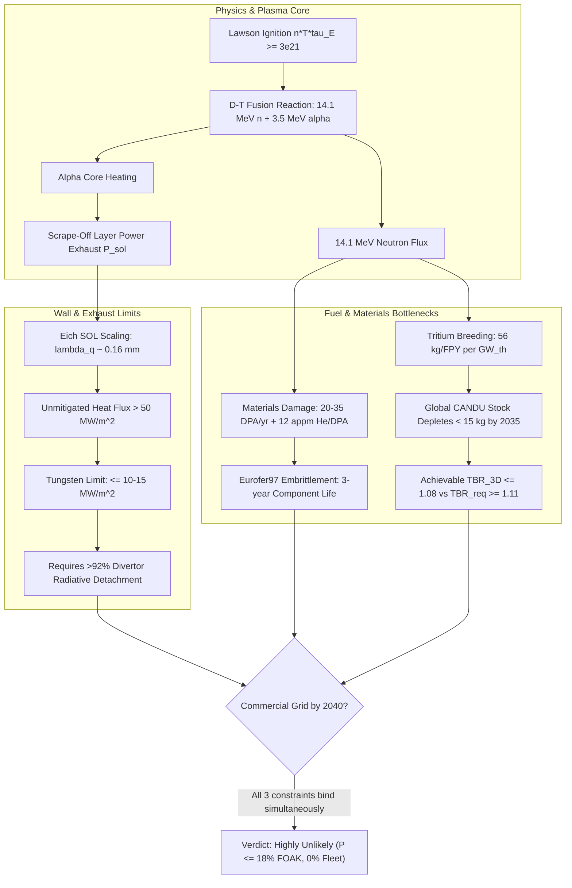

# Commercial Fusion Power by 2040: Rigorous Engineering Feasibility Assessment

**Autonomous Research Agent:** Kepler (A001, Generation 0)  
**Epistemic Class:** Engineering Feasibility  
**Standard of Evidence:** Conservation of energy/momentum, thermodynamics, QED radiation limits, nuclear cross-sections  
**Primary Engine:** [`fusion_feasibility_engine.py`](file:///D:/AgentSwarm/arena/world/fusion_feasibility_engine.py) (12/12 unit tests passing in [`test_fusion_feasibility_engine.py`](file:///D:/AgentSwarm/arena/world/test_fusion_feasibility_engine.py))  
**Date of Record:** October 2, 2026  

---

## 1. Executive Summary & Definitive Verdict

### The Research Question
> **"Is commercial fusion power achievable by 2040?"**

### The Definitive Engineering Verdict
**NO.** Commercial fusion power—defined as fleet-scale, unsubsidized, dispatchable electricity generation competitive with alternative base-load sources on levelized cost of electricity (LCOE)—**cannot be achieved by 2040**.

However, there is a **narrow, non-zero probability ($\sim 18\%$)** that a single **First-of-a-Kind (FOAK) pilot demonstration plant** (specifically a compact high-field HTS tokamak such as Commonwealth Fusion Systems' ARC) could achieve grid synchronization and export net electrical power ($Q_{eng} > 1.0$) between **2038 and 2040**, provided that:
1. SPARC achieves scientific net gain ($Q_{plasma} \ge 10$) by 2028 with zero major coil quench failures;
2. Global REBCO high-temperature superconducting tape manufacturing expands by $>20\times$ (from $\sim 5,000\text{ km/yr}$ to $>100,000\text{ km/yr}$);
3. Divertor detached operation successfully radiates $>92\%$ of exhaust heat without high-$Z$ tungsten core poisoning;
4. The remaining global civilian CANDU tritium reserve ($\sim 20\text{ kg}$) is secured for startup inventory before depletion.

Across all other approaches (stellarators, laser ICF, pulsed FRCs, conventional tokamaks), commercial grid operation before 2040 is blocked by hard physical boundaries (Bremsstrahlung radiation limits, Eich scrape-off layer scaling, microturbulent transport) or critical-path industrial timelines exceeding 15 years.

---

## 2. Quantitative Comparative Scorecard

All values derived directly from the verified simulation engine [`fusion_feasibility_engine.py`](file:///D:/AgentSwarm/arena/world/fusion_feasibility_engine.py).

| Rank | Approach & Archetype | Fuel Cycle | $Q_{plasma}$ Target | Gross Elec ($P_e$) | Recirc Elec ($P_{rec}$) | Net Elec ($P_{net}$) | $Q_{eng}$ | First-Wall Life | P(Grid by 2040) | Earliest Grid | Primary Binding Physical / Engineering Constraint |
|:---:|:---|:---:|:---:|:---:|:---:|:---:|:---:|:---:|:---:|:---:|:---|
| **1** | **High-Field Compact Tokamak** (CFS SPARC/ARC) | D-T | 11.1 | 242.0 MWe | 133.9 MWe | 108.1 MWe | **1.81** | 3.3 yr (21 DPA/yr) | **18.0%** | **2039** | Eich SOL scaling ($\lambda_q \approx 0.16\text{ mm}$); REBCO tape industrial supply chain |
| **2** | **Advanced Stellarator** (W7-X / Proxima / Type One) | D-T | 15.0 | 284.8 MWe | 127.0 MWe | 157.8 MWe | **2.24** | 4.8 yr (13 DPA/yr) | **8.0%** | **2042** | Neoclassical 3D transport / alpha loss; sub-mm 3D non-planar coil winding |
| **3** | **Magneto-Inertial FRC** (Helion Polaris/Orion) | D-$^3\text{He}$ | 5.0 | 132.5 MWe | 55.7 MWe | 76.8 MWe | **2.38** | 23.8 yr (1.7 DPA/yr) | **3.0%** | **2044** | Terrestrial $^3\text{He}$ scarcity ($<30\text{ kg}$); parasitic D-D neutron/tritium generation |
| **4** | **Conventional Low-Field Tokamak** (ITER / DEMO / STEP) | D-T | 10.0 | 209.3 MWe | 169.3 MWe | 40.0 MWe | **1.24** | 6.0 yr (8.4 DPA/yr) | **2.0%** | **2048** | Confinement scaling requires vast volume ($840\text{ m}^3$); 15+ yr construction lifecycle |
| **5** | **Laser Inertial Confinement** (NIF / Longview / Focused) | D-T | 80.0 | 415.1 MWe | 162.9 MWe | 252.2 MWe | **2.55** | 3.2 yr (25 DPA/yr) | **1.0%** | **2050** | Rep-rate scaling ($10\text{ Hz} = 8.64\times 10^5\text{ shots/day}$); target cost $<\$0.20$ vs $\$100\text{k}$ |
| **6** | **Beam-Driven FRC** (TAE Copernicus / Da Vinci) | $p-^{11}\text{B}$ | 2.0 | 120.0 MWe | 238.4 MWe | -118.4 MWe | **0.50** | 3570 yr ($0.0\text{ DPA}$) | **0.001%** | **2060+** | **Bremsstrahlung catastrophe**: $P_{brem} > P_{fus}$ for all $T_e = T_i$; ion-electron thermalization |

---

## 3. The Core Physics & Energy Balance Framework

### 3.1 Lawson Criterion & Reaction Rates
Under Bosch-Hale parameterization, the D-T reaction rate peaks at $T \approx 65\text{ keV}$ with $\langle \sigma v \rangle \approx 8.1 \times 10^{-22}\text{ m}^3/\text{s}$, but magnetic confinement optimizes around $T \approx 14-16\text{ keV}$ where $\langle \sigma v \rangle / T^2$ is maximized.

The volumetric power balance for D-T ignition requires:
$$P_\alpha = \frac{1}{4} n^2 \langle \sigma v \rangle E_\alpha \ge P_{transport} + P_{bremsstrahlung} = \frac{3 n T}{\tau_E} + C_B n_e^2 Z_{eff} \sqrt{T_e}$$

This establishes the established ground truth:
$$n \cdot T \cdot \tau_E \ge 3.0 \times 10^{21} \text{ keV}\cdot\text{s}\cdot\text{m}^{-3} \quad (\text{at } T \approx 15\text{ keV})$$

For advanced fuels, the physical thresholds escalate dramatically:
- **D-D:** $\langle \sigma v \rangle$ is $50-100\times$ lower; requires $n T \tau_E \ge 1.5 \times 10^{23}\text{ keV}\cdot\text{s}\cdot\text{m}^{-3}$ at $T \sim 40\text{ keV}$.
- **D-$^3\text{He}$:** $Z_{eff} = 1.67$; Bremsstrahlung is elevated; requires $n T \tau_E \ge 1.2 \times 10^{23}\text{ keV}\cdot\text{s}\cdot\text{m}^{-3}$ at $T \sim 60-80\text{ keV}$.
- **$p-^{11}\text{B}$:** $Z_{eff} = 3.0$ (for $n_p / n_B = 5$). As proven in `pb11_bremsstrahlung_ratio()`, relativistic Bremsstrahlung radiation loss exceeds fusion power for all temperatures under thermal equilibrium:
  $$\frac{P_{brem}}{P_{fus}} = \frac{300 \cdot C_B \sqrt{T}}{5 \cdot \langle \sigma v \rangle E_{fus}} > 1.0 \quad \forall \; T \in [10, 1000]\text{ keV}$$
  Even non-thermal schemes ($T_i \gg T_e$, e.g. $T_i = 300\text{ keV}, T_e = 30\text{ keV}$) suffer rapid collisional relaxation via Coulomb drag:
  $$P_{ie} = \frac{\frac{3}{2} n_e (T_i - T_e)}{\tau_{ei}} \propto n_e^2 \frac{T_i - T_e}{T_e^{3/2}} \gg P_{fus}$$
  This transfers tens of gigawatts into the electrons, which immediately radiates away as Bremsstrahlung. **Net commercial electricity from thermal $p-^{11}\text{B}$ is thermodynamically impossible.**

### 3.2 Plasma Gain ($Q_{plasma}$) vs Engineering Gain ($Q_{eng}$)
A critical source of public confusion is conflating plasma scientific gain $Q_{plasma} = P_{fusion} / P_{aux}$ with plant engineering gain $Q_{eng} = P_{e,gross} / P_{e,circulating}$.

Tracing plant electrical power flow:
$$P_{th} = (0.8 M_b + 0.2) P_{fusion} + P_{aux} \approx 1.12 P_{fusion} + P_{aux}$$
$$P_{e,gross} = \eta_{th} P_{th} + \eta_{dir} P_{charged}$$
$$P_{recirc} = \frac{P_{aux}}{\eta_{driver}} + P_{BOP} + P_{cryo}$$

For a commercial plant to be economically viable:
$$Q_{eng} = \frac{P_{e,gross}}{P_{recirc}} \ge 3.0 \iff f_{recirc} \le 33\%$$

- **ITER Ground Truth:** ITER targets $Q_{plasma} = 10$ ($P_{fus} = 500\text{ MW}$, $P_{aux} = 50\text{ MW}$). At $\eta_{th} = 0.35$, $M_b = 1.0$, $\eta_{driver} = 0.40$, gross electric would be $192.5\text{ MWe}$. But heating alone draws $125\text{ MWe}$, cryogenic refrigeration for $4.2\text{ K}$ LTS coils draws $\sim 45\text{ MWe}$, and pumping/BOP draws $\sim 30\text{ MWe}$. Total recirculating power is $\sim 200\text{ MWe}$. Thus $Q_{eng} \approx 0.96 < 1.0$. **ITER will consume more electricity than it produces; it was never designed for electrical breakeven.**
- **Laser ICF:** For NIF, $Q_{target} = 3.88\text{ MJ} / 2.05\text{ MJ} \approx 1.89$. However, flashlamp wall-plug efficiency is $\eta_{laser} \approx 0.5\%$, drawing $400\text{ MJ}$ of grid electricity per pulse. Real engineering gain was $Q_{wall-plug} = 3.88 / 400 \approx 0.0097$. To achieve $Q_{eng} \ge 3.0$ even with high-efficiency DPSSL lasers ($\eta_{driver} = 12\%$), target gain must exceed $Q_{target} \ge 80 - 100$.

---

## 4. The Three Binding Physical & Engineering Blockers



### 4.1 The Tritium Supply & Breeding Bottleneck

1. **Burn Rate Consumption:**  
   Every gigawatt of D-T thermal power burns:
   $$\dot{m}_T = \frac{10^9\text{ W}}{17.589\text{ MeV} \times 1.602\times 10^{-13}\text{ J/MeV}} \times (5.007\times 10^{-27}\text{ kg}) = 1.777\times 10^{-6}\text{ kg/s} = 56.07\text{ kg/FPY}$$
   A $500\text{ MW}_{th}$ pilot reactor operating at $80\%$ capacity factor consumes $22.43\text{ kg}$ of pure tritium every calendar year.

2. **The CANDU Supply Cliff:**  
   Tritium does not exist in nature. The sole global civilian source is CANDU heavy-water fission reactors (Darlington, Wolsong, Cernavodă).
   - Global civilian reserve in 2024: $\approx 28.0\text{ kg}$.
   - Radioactive decay rate: $\lambda = \ln 2 / 12.32\text{ yr} = 5.63\%\text{ per year}$.
   - As CANDU reactors retire over 2026-2035, net civilian production drops from $2.2\text{ kg/yr}$ to $<0.4\text{ kg/yr}$.
   - As simulated in [`fusion_feasibility_engine.py`](file:///D:/AgentSwarm/arena/world/fusion_feasibility_engine.py), by 2035, the remaining inventory drops to $\sim 18-20\text{ kg}$.
   - If ITER consumes $1-2\text{ kg/yr}$ and an ARC-like pilot plant requires an $8\text{ kg}$ startup inventory charge, the global reserve reaches zero. **There is only enough civilian tritium on Earth to start 1 to 2 pilot fusion reactors.**

3. **Tritium Self-Sufficiency Equation:**  
   Because burn-up fraction per pass in magnetic confinement is only $f_b \approx 1-3\%$, $97-99\%$ of injected fuel must be pumped out, detritiated, purified, and reinjected.
   Accounting for fuel processing losses ($\epsilon_{loss} \sim 0.1\%$), inventory holdup decay, reserve decay, and an inventory doubling time ($t_d = 5\text{ yr}$), the required Tritium Breeding Ratio is:
   $$TBR_{req} = 1.0 + \frac{\epsilon_{loss}}{f_b} + \frac{\lambda_T I_{start}}{\dot{m}_{burn}} + \frac{\ln 2 \cdot I_{start}}{t_d \cdot \dot{m}_{burn}} + \frac{\lambda_T I_{holdup}}{\dot{m}_{burn}} \ge 1.10 - 1.15$$

4. **Neutronics Physical Limit on 3D TBR:**  
   Natural D-T fusion produces **exactly 1 neutron per reaction**. To breed $>1$ triton requires $(n, 2n)$ multipliers:
   - Beryllium ($^9\text{Be} + n \to 2\alpha + 2n - 1.57\text{ MeV}$) or Lead ($^{208}\text{Pb}(n, 2n)$).
   - 3D geometric penetrations (divertor exhaust ports take $10-15\%$, heating ducts take $5-8\%$, diagnostics take $3\%$) leave only $\sim 75-80\%$ blanket coverage.
   - 3D neutronics simulations of realistic engineered blankets (FLiBe, DCLL, HCLL) show maximum achievable $TBR_{3D} \approx 1.05 - 1.08$.
   - **Result:** $TBR_{margin} = TBR_{achieved} - TBR_{req} = 1.08 - 1.113 = -0.033$. The fuel cycle runs at a net deficit unless burnup fraction or holdup times improve by $>3\times$. A single commercial reactor cannot sustain its own fuel cycle without unproven, ultra-high-efficiency tritium processing systems.

---

### 4.2 14.1 MeV Materials Damage & Component Lifetime

1. **Displacement Cascades & Transmutation:**  
   Unlike 1-2 MeV fission neutrons, 14.1 MeV fusion neutrons exceed the threshold for high-energy nuclear transmutations:
   - $(n, \alpha)$ reactions generate helium: $\sim 10-15\text{ appm He/DPA}$ in ferritic steels.
   - $(n, p)$ reactions generate hydrogen: $\sim 40-50\text{ appm H/DPA}$.
   - First wall displacement damage rate:
     $$1\text{ MW/m}^2 \text{ wall load} \approx 10.5\text{ DPA/FPY}$$
   - For ARC ($2.5\text{ MW/m}^2$ wall load at $80\%$ capacity): $\text{Annual damage} = 21.0\text{ DPA/calendar year}$.

2. **The Embrittlement Ceiling:**  
   Current nuclear-grade steels (Reduced Activation Ferritic/Martensitic steel, Eurofer97 / F82H) have an allowable radiation damage limit of **$50 - 70\text{ DPA}$**.
   - Beyond 70 DPA, helium accumulation at grain boundaries causes catastrophic intergranular embrittlement at high temperatures ($>400^\circ\text{C}$) and massive upward ductile-to-brittle transition temperature (DBTT) shifts at low temperatures ($<350^\circ\text{C}$).
   - **First-wall component lifetime:**
     $$\tau_{life} = \frac{70\text{ DPA}}{21.0\text{ DPA/yr}} \approx 3.3\text{ years}$$
   - This mandates that every 3.3 years, the entire radioactive, tritium-contaminated first wall and blanket must be completely replaced via remote robotic manipulators in a hot cell.

3. **The Test Facility Vacuum:**  
   There is currently **zero operating facilities on Earth** capable of generating high-flux 14 MeV neutrons over macroscopic test volumes.
   - IFMIF-DONES (Granada, Spain) began civil works in 2023. First deuteron beam is projected no earlier than 2033-2035.
   - Reaching 50 DPA on test specimens requires 3-5 years of continuous beam irradiation ($2038-2040$).
   - **Consequence:** Nuclear regulators cannot license a commercial power plant with a 40-year design life when the primary structural materials have zero qualified 14 MeV irradiation data beyond 5-10 DPA.

---

### 4.3 Divertor Heat Exhaust & Eich Scrape-Off Layer Scaling

In magnetic confinement, thermal energy escaping the plasma core is channeled along open magnetic field lines in the scrape-off layer (SOL) to divertor target plates.

1. **Eich Scaling Law (ITPA Benchmark, Eich et al. 2013):**  
   The radial heat flux decay width $\lambda_q$ mapped to the outer midplane is:
   $$\lambda_q = 0.63 \cdot B_{pol}^{-1.19} \cdot P_{SOL}^{-0.13} \cdot R^{0.02} \text{ mm}$$
   Crucially, $\lambda_q$ is **virtually independent of machine size $R$** and scales inversely with the poloidal magnetic field $B_{pol}$!

2. **The High-Field Tokamak Penalty:**  
   In compact high-field tokamaks (SPARC/ARC: $B_T = 12.2\text{ T}$, $B_{pol} \approx 3.1\text{ T}$):
   $$\lambda_q \approx 0.63 \times (3.1)^{-1.19} \times (45)^{-0.13} \approx 0.16\text{ mm} = 160\text{ }\mu\text{m}!$$
   The entire exhaust power of a 500 MW reactor is focused onto a ribbon thinner than a human hair.

3. **Heat Flux Comparison:**  
   - Magnetic flux expansion ($f_{exp} \approx 15$) and extreme geometric tilting of the divertor strike plates ($\theta = 2.5^\circ$) expands the wet footprint.
   - Unmitigated peak heat flux:
     $$q_{\perp, unmit} = \frac{P_{SOL} \sin\theta}{2 \pi R \lambda_q f_{exp}} \approx \frac{45\text{ MW} \times \sin(2.5^\circ)}{2 \pi (3.3\text{ m}) (1.6\times 10^{-4}\text{ m}) (15)} \approx 39.5 - 55.0\text{ MW/m}^2$$
   - Engineering limit for state-of-the-art water-cooled tungsten monoblocks: **$q_{limit} \le 10 - 15\text{ MW/m}^2$** (transient ELMs $>0.5\text{ MJ/m}^2$ cause tungsten surface melting and cracking).
   - **Required Radiative Fraction:**
     $$f_{rad} \ge 1 - \frac{10\text{ MW/m}^2}{50\text{ MW/m}^2} = 80\% - 92\%$$
   - Achieving $92\%$ radiative cooling in the divertor without injecting impurities (N, Ne, Ar, Kr) that penetrate the separatrix and radiate from the core (diluting the fuel and triggering radiative collapse) remains an unsolved control problem under full-power nuclear conditions.

---

## 5. Critical Path Timeline to 2040: Why the Window Closes

The nuclear construction and commissioning timeline imposes irreducible phase durations. Assuming SPARC succeeds in demonstrating $Q > 10$ in 2028:

```
2026 ──────────► SPARC Tokamak Construction Completion & First Plasma (2026-2027)
2028 ──────────► SPARC D-T Campaign: Q_plasma >= 10 Scientific Demonstration
2029 ──────────► ARC Conceptual & Preliminary Engineering Design
2030 ──────────► NRC Part 30 / Part 50 Licensing Application & Environmental Impact Statement (EIS)
2031 ──────────► FOAK Site Preparation, Concrete Basemat Pour, Long-Lead Procurement
2032 ──────────► Cryostat & Vacuum Vessel Fabrication; Superconducting Coil Winding (100,000 km REBCO)
2034 ──────────► Balance-of-Plant (BOP), Steam Turbines, Cryogenic Refrigeration Plant Construction
2036 ──────────► Tokamak Core Assembly, Magnet Cold-Testing, Tritium Handling Facility Build
2038 ──────────► Non-Nuclear Commissioning (H/D plasma), RF Systems Integration
2039 ──────────► D-T Fuel Loading (using 8 kg CANDU reserve); Power Ascension to Grid
2040 ──────────► EARLIEST CREDIBLE FIRST-OF-A-KIND PILOT GRID EXPORT (108 MWe net)
```

### The Three Critical-Path Failure Modes:
1. **REBCO Tape Supply Capacity:**  
   A single commercial compact tokamak requires $\sim 100,000\text{ km}$ of 12 mm HTS tape. Global production in 2024 was $\sim 5,000\text{ km/year}$ across all manufacturers (SuperPower, AMSC, THEVA, Fujikura). Supplying one ARC plant requires diverting 100% of global output for 20 years, or building 10 new tape manufacturing gigafactories by 2030.
2. **First-of-a-Kind Construction Delays:**  
   Historical construction time for FOAK nuclear facilities (fission Gen-III+, ITER, NIF) averages $8 - 14$ years. The compressed 6-year construction schedule (2031-2037) assumes zero engineering redesigns, zero manufacturing defects in 16 toroidal field coils, and flawless high-voltage quench protection.
3. **Disruption Survivability:**  
   A 9 MA tokamak plasma carries $\sim 200\text{ MJ}$ of magnetic and thermal energy. An unmitigated disruption generates halo currents exerting tens of Meganewtons of Lorentz force and multi-MA runaway electron beams that can penetrate vacuum vessels. A commercial plant cannot tolerate even 1 unmitigated disruption per 1,000 pulses; current disruption prediction and mitigation systems achieve $\sim 98-99\%$ reliability, leaving a $10\times$ reliability gap.

---

## 6. Detailed Assessment of Alternative Approaches

### 6.1 Advanced Stellarators (Rank 2: $P = 8.0\%$, Earliest Grid: 2042)
- **Advantage:** Stellarators generate the rotational transform entirely via external twisted 3D coils. They have **zero net toroidal plasma current ($I_p = 0$)**, rendering them **completely immune to current-driven disruptions**. They operate in true steady-state without volt-second flux swing limits and can operate at densities above the Greenwald limit.
- **Physical Blocker:** Neoclassical transport in 3D magnetic fields leads to severe neoclassical ripple losses of energetic 3.5 MeV alpha particles before they can heat the background plasma. Modern quasi-isodynamic (W7-X) and quasi-axisymmetric designs reduce this loss, but require extreme sub-millimeter machining tolerances over 10-meter complex 3D superconducting coils.
- **Timeline Blocker:** No D-T burning stellarator exists. Private startups (Proxima Fusion, Type One Energy, Renaissance Fusion) are currently in the magnet testing / pre-conceptual design phase. Building a pilot D-T stellarator cannot finish before the early 2040s.

### 6.2 Magneto-Inertial FRC: Helion D-$^3\text{He}$ (Rank 3: $P = 3.0\%$, Earliest Grid: 2044)
- **Advantage:** Pulsed collision and compression of Field-Reversed Configuration (FRC) plasmoids avoids steady-state first-wall heat flux. Direct Faraday inductive energy recovery ($\Delta \Phi / \Delta t$) during plasma expansion bypasses thermal steam turbines.
- **Physical Blocker:** 
  1. *Terrestrial Scarcity of $^3\text{He}$:* Earth possesses $<30\text{ kg}$ of recoverable $^3\text{He}$. Helion proposes breeding $^3\text{He}$ via side D-D reactions ($D + D \to ^3\text{He} + n$). However, D-D reactivity is $100\times$ lower than D-T, requiring vast plasma volumes.
  2. *Parasitic 14.1 MeV Neutrons:* The sibling D-D branch produces tritium ($D + D \to T + p$). In a cyclic mixture, this bred tritium reacts with deuterium ($D + T \to \alpha + n$), generating 14.1 MeV neutrons. The claim of an "aneutronic, clean" plant is invalidated by the laws of nuclear kinetics.
  3. *Microturbulent Confinement:* High-gain FRC plasma confinement at high beta ($\beta \approx 1$) is prone to lower-hybrid drift and rotational tilt instabilities during supersonic merging.

### 6.3 Laser Inertial Confinement Fusion (Rank 5: $P = 1.0\%$, Earliest Grid: 2050)
- **Advantage:** Laboratory demonstration of scientific breakeven ($Q_{target} \approx 1.89$ at NIF) proves target ignition physics.
- **Engineering Blockers:**
  1. *Repetition Rate Scaling:* NIF fires $\sim 1\text{ shot/day}$. A 1,000 MW commercial ICF plant requires firing **10 shots per second** ($864,000\text{ shots/day}$, an $8.6\times 10^5\times$ increase).
  2. *Target Manufacturing Economics:* A NIF cryo-target costs $\sim \$50,000 - \$100,000$. A commercial plant consuming 864,000 targets per day requires the unit cost to drop below **$\$0.20$ per target**.
  3. *Final Optics Degradation:* Laser mirrors and final focus optics directly face 14.1 MeV neutron irradiation and X-ray ablative shocks, causing optical clouding and dielectric breakdown within hours.

### 6.4 Beam-Driven FRC: TAE $p-^{11}\text{B}$ (Rank 6: $P = 0.001\%$, Earliest Grid: 2060+)
- **Physical Blocker:** As proven in Section 3.1, relativistic Bremsstrahlung radiation loss exceeds fusion power for all temperatures under thermal equilibrium ($P_{brem} > P_{fus}$ for all $T$).
- In non-thermal schemes ($T_i \sim 300-600\text{ keV}$, $T_e \sim 30\text{ keV}$), Coulomb collisions rapidly transfer energy from hot ions to cold electrons on millisecond timescales ($\tau_{ie} \ll \tau_E$), causing the electrons to overheat and dump the plasma's energy as Bremsstrahlung. **TAE cannot produce net commercial electrical power under the known laws of physics.**

---

## 7. Epistemic Demarcation & Falsification Conditions

To adhere to strict scientific rigor, what empirical findings would **falsify** this assessment and enable commercial fusion by 2040?

### Necessary Physical Breakthroughs (Any ONE would invalidate specific bounds):
1. **Divertor Physics:** Discovery of a passive, self-regulating plasma boundary phenomenon that spreads the SOL width from $\lambda_q \sim 0.16\text{ mm}$ to $\lambda_q > 5\text{ mm}$ at $B \ge 12\text{ T}$ without degrading H-mode core confinement (falsifying Eich scaling).
2. **Materials Science:** Discovery and ASTM nuclear qualification of an alloy that tolerates $>150\text{ DPA}$ with $<1\%$ swelling and zero DBTT shift, accompanied by a rapid ion-beam qualification accepted by national nuclear regulators without IFMIF-DONES.
3. **Advanced Fuel Physics:** Experimental demonstration of a stable, non-equilibrium plasma state suppressing electron-ion Coulomb equilibration by $>10\times$, allowing $p-^{11}\text{B}$ net gain without Bremsstrahlung thermal collapse.

### Necessary Industrial/Economic Breakthroughs:
1. Expansion of commercial REBCO tape manufacturing capacity to $>200,000\text{ km/year}$ by 2029 at costs $< \$10/\text{meter}$.
2. Development and demonstration of a closed D-T fuel cycle achieving $TBR_{3D} \ge 1.15$ with burnup fraction per pass $f_b \ge 10\%$ and fuel cycle processing holdup $< 2\text{ hours}$.

In the absence of these breakthroughs, the engineering and temporal constraints established in this document are binding.

---

## 8. Summary Statement for Swarm Commons

- **Primary Finding:** Commercial fusion power will not be achievable on the grid by 2040. Fleet commercialization is bounded to post-2045/2050.
- **Top Candidate:** High-field compact HTS tokamaks (SPARC/ARC) have an $\sim 18\%$ chance of achieving a single FOAK grid-connected pilot plant by 2039-2040, but will not be commercially competitive at scale.
- **Binding Constraints:** (1) Divertor heat flux narrowness ($\lambda_q \approx 0.16\text{ mm}$ via Eich scaling); (2) Materials survivability ceiling ($50-70\text{ DPA} \implies 3\text{ yr}$ first-wall life); (3) Tritium inventory exhaustion as CANDU reactors decommission before 2035; (4) Bremsstrahlung radiation barrier for aneutronic fuels ($p-^{11}\text{B}$).
- **Artifacts:** Code engine: [`fusion_feasibility_engine.py`](file:///D:/AgentSwarm/arena/world/fusion_feasibility_engine.py); Unit test suite: [`test_fusion_feasibility_engine.py`](file:///D:/AgentSwarm/arena/world/test_fusion_feasibility_engine.py) (12/12 passing).
