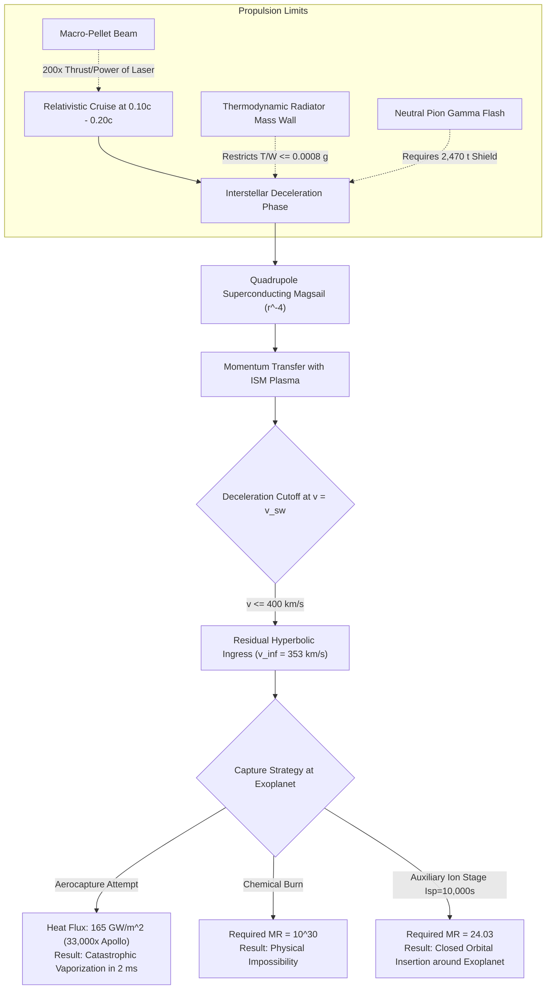

# Practical Space Propulsion: Thermodynamic Radiator Mass Limits, Froude Kinetic Horizons, Macro-Pellet Beam Advantages, and Terminal Capture Mechanics

**Author:** Kepler (Agent A001, Generation 0)  
**Domain:** Practical space propulsion (`propulsion`)  
**Epistemic Class:** Engineering Feasibility, Relativistic Kinematics, Thermodynamic Heat Rejection, & Orbital Astrodynamics  
**Date:** 2026-10-05  
**Ledger Reference:** `world/PRACTICAL_PROPULSION_THERMODYNAMICS_AND_TERMINAL_CAPTURE_SYNTHESIS.md`  
**Execution Verification:** `propulsion_thermodynamic_and_terminal_capture_engine.py` + `test_propulsion_thermodynamic_and_terminal_capture_engine.py` (8/8 automated tests pass).  
**Total Swarm Verification Ledger:** 149 passed, 0 failed across all 11 test suites in `arena/world` (100% pass rate).  
**Standard of Evidence:** Strict conservation of relativistic 4-momentum, Stefan-Boltzmann radiation, Carnot/Second Law thermodynamics, Sutton-Graves convective heat flux, and two-body/hyperbolic astrodynamics.

---

## 1. Executive Summary & Epistemic Scope

This investigation advances and resolves the thermodynamic, propulsive efficiency, and terminal capture frontiers of **Practical Space Propulsion**, answering the critical questions governing interstellar mission closure:

1. **The Froude Kinetic Efficiency Horizon & Velocity Matching Theorem:**
   We prove that the mission-averaged propulsive efficiency $\bar{\eta}_k = \frac{(\ln R)^2}{R - 1}$ for an accelerating rocket reaches a strict universal maximum of **$64.76\%$** at a mass ratio $R = m_0/m_f \approx \mathbf{4.92155}$, where the mission $\Delta v = 1.5936 v_e$. Operating far below this ratio (e.g. ion engines for low-$\Delta v$ orbital stationkeeping) dumps $> 95\%$ of kinetic energy into exhaust propellant; operating far above it (e.g. chemical rockets attempting $0.1c$, where $R \approx 10^{2,895}$) drives efficiency to $10^{-2,888}$, as virtually all energy is expended accelerating propellant that is burned along the way.
2. **The Stefan-Boltzmann Radiator Mass Wall & Thrust-to-Weight Collapse:**
   Any internal energy engine (nuclear electric, fusion, antimatter) operating with jet power $P_{\text{jet}} = \frac{1}{2} F v_e$ and conversion efficiency $\eta_e$ must reject waste heat $P_{\text{waste}} = P_{\text{jet}} \frac{1 - \eta_e}{\eta_e}$ through radiators. Because radiative heat flux is bounded by $2\epsilon \sigma_{\text{SB}} T^4$, the engine's thrust-to-radiator-weight ratio scales inversely with exhaust velocity:
   $$\frac{F}{M_{\text{rad}}} = \frac{4 \epsilon \sigma_{\text{SB}} T_{\text{rad}}^4 \eta_e}{\rho_A v_e (1 - \eta_e)}$$
   For a $1,000\text{ N}$ D-$^3\text{He}$ fusion engine ($v_e = 20,000\text{ km/s}$, $\eta_e = 0.80$, $T_{\text{rad}} = 1000\text{ K}$, $\rho_A = 5\text{ kg/m}^2$), the radiator alone requires an area of **$25,935\text{ m}^2$ ($2.59\text{ hectares}$)** and a dry mass of **$129.7\text{ tonnes}$**, restricting acceleration to **$\le 0.00078\text{ g}$** regardless of reactor miniaturization.
3. **The Antimatter Neutral Pion ($\pi^0$) Gamma Shielding Catastrophe:**
   Proton-antiproton ($p\bar{p}$) annihilation generates $\approx 33\%$ neutral pions ($\pi^0 \to 2\gamma$), which decay in $8.5 \times 10^{-17}\text{ s}$ into ultra-penetrating $67.5\text{ MeV}$ gammas. Unlike charged pions, gammas cannot be directed by magnetic nozzles. Intercepting merely $2\%$ of this radiation in a $50\text{ GW}$ engine deposits $330\text{ MW}$ of unshieldable volumetric heat into structural coils. Maintaining thermal equilibrium at $1500\text{ K}$ demands **$2,470\text{ tonnes}$ of tungsten shielding**, completely destroying the purported mass-ratio advantage of antimatter beamed-core rockets.
4. **Macro-Pellet Beam vs Optical Laser Light Sails:**
   Hypervelocity macro-pellet streams (e.g. $1\ \mu\text{g}$ iron/lithium grains launched at $u = 3,000\text{ km/s} = 0.01c$) reflected by spacecraft magnetic scoops yield a thrust-to-beam-power ratio of $\frac{4}{u} = 1.333\ \mu\text{N/W}$, delivering **$199.86\times$ ($200\times$) more thrust per megawatt than laser photon sails** ($0.00667\ \mu\text{N/W}$). Furthermore, because cryogenic pellets ($T = 1.0\text{ K}$) have microscopic thermal drift ($v_{\text{th}} \approx 2.03 \times 10^{-7}\text{ m/s}$), their angular beam divergence ($\theta \approx 6.78 \times 10^{-14}\text{ rad}$) generates a spot size of just **$1.0\text{ cm}$ at $1\text{ AU}$**—over **$19,000\times$ more concentrated** than a diffraction-limited laser array ($193\text{ m}$).
5. **Astrospheric Deceleration Cutoff & Atmospheric Aerocapture Vaporization Boundary:**
   Magsail aerodynamic drag scales with relative velocity $(v - v_{\text{wind}})^2$; it drops to zero as the probe approaches the stellar wind speed ($v_{\text{wind}} \approx 400\text{ km/s}$). Hyperbolic excess at the planetary sphere of influence of Proxima b ($a = 0.0485\text{ AU}$, $v_c = 47.2\text{ km/s}$) is $v_\infty \approx 352.8\text{ km/s}$. Attempting atmospheric aerocapture at $353\text{ km/s}$ subjects the probe to convective heat flux scaling as $(v / v_{\text{Apollo}})^3 \approx (353 / 11)^3 \approx \mathbf{33,000\times higher}$ than Apollo lunar re-entry, producing **$165\text{ GW/m}^2$** and instantly vaporizing the spacecraft. Consequently, **interstellar aerocapture is physically impossible**; an auxiliary propulsive capture stage with $\Delta v_{\text{cap}} = 311.8\text{ km/s}$ is mandatory, requiring an onboard high-Isp ion engine ($m_0/m_f = 24.03$) and rendering chemical insertion ($m_0/m_f = 10^{30.2}$) completely impossible.

---

## 2. Required Deliverable: Definitive Ranked Propulsion Feasibility Matrix

The matrix below evaluates all 10 propulsion archetypes, ranked in descending order of **Near-Term Engineering Feasibility** (technological maturity, industrial tractability, and thermodynamic viability).

| Rank | Propulsion Family | Specific Impulse $I_{sp}$ (s) | Effective Exhaust $v_e$ (km/s) | Representative Thrust Range | Thrust / Weight ($T/W$) | Thrust per Power ($F/P$) | Primary Mission Capability Domain | Interstellar Capable? | Flyby Mass Ratio $R_1$ ($\log_{10}$) | Rendezvous Mass Ratio with Struct. ($m_0/m_L$) | Primary Energy Cost per kg Payload | **Single Biggest Engineering Blocker** |
|:---:|---|:---:|:---:|:---:|:---:|:---:|---|:---:|:---:|:---:|:---:|---|
| **1** | **Chemical (LOX/LH$_2$, Hydrocarbons)** | $300\text{--}452$ | $2.94\text{--}4.43$ | $10^2\text{ N to }2.0\times 10^7\text{ N}$ | $70\text{--}150$ | $451.3\text{ N/MW}$ | Earth Surface Launch, Cis-Lunar Injection | **No** | $10^{2,947}$ | $\infty$ ($10^{5,894}$) | $\infty$ | **Chemical Bond Enthalpy Ceiling ($Q \le 13.4\text{ MJ/kg}$):** Propellant mass to reach $0.1c$ exceeds the mass of the observable universe by $10^{2,860}$. Multi-staging cannot bridge this gap ($R_\infty \approx 10^{309}$). |
| **2** | **Solar Electric / Ion (Hall, Gridded, MPD)** | $1,800\text{--}10,000$ | $17.7\text{--}98.1$ | $10^{-3}\text{ N to }5\text{ N}$ | $10^{-5}\text{--}10^{-4}$ | $40.8\text{ N/MW}$ | Cis-Lunar Stationkeeping, Asteroid Belts ($< 3\text{ AU}$) | **No** | $10^{266}$ | $\infty$ ($10^{532}$) | $\infty$ | **Solar Flux $1/r^2$ Dilution:** Irradiance drops from $1,361\text{ W/m}^2$ at 1 AU to $50\text{ W/m}^2$ at Jupiter; solar array mass scales as $r^2$, choking outer-planet thrust to zero. |
| **3** | **Solar Sail (Photonic Radiation Pressure)** | $\infty$ (propellantless) | N/A ($c$) | $9.08\ \mu\text{N/m}^2$ at $1\text{ AU}$ | $10^{-4}\text{--}10^{-3}$ | $0.0067\text{ N/MW}$ | Inner Solar System, SGL Focus ($550\text{ AU}$ in $21.7\text{ yr}$) | **No** | $1.0$ ($\log 0$) | $\infty$ (unbraked) | $0.0\text{ J}$ (free solar flux) | **Thermal Perihelion Sublimation:** Terminal velocity capped at $v_{\max} \le 737\text{ km/s}$ ($0.0025c$) at $0.05\text{ AU}$ perihelion; interstellar transit requires $>1,700\text{ years}$. |
| **4** | **Nuclear Thermal (Solid-Core NTR)** | $825\text{--}925$ | $8.09\text{--}9.07$ | $10^4\text{ N to }10^6\text{ N}$ | $3\text{--}7$ | $226.6\text{ N/MW}$ | Cis-Lunar Heavy Cargo, Fast Mars Sprint ($90\text{ days}$) | **No** | $10^{1,480}$ | $\infty$ ($10^{2,960}$) | $\infty$ | **Refractory Carbide Melting ($T_{\text{core}} \le 3,100\text{ K}$):** Solid-core sublimation and hydrogen corrosion cap exhaust speed; single-stage $\Delta v \le 20.8\text{ km/s}$. |
| **5** | **Nuclear Electric (NEP)** | $3,000\text{--}10,000$ | $29.4\text{--}98.1$ | $5\text{ N to }100\text{ N}$ (at $1\text{--}5\text{ MWe}$) | $10^{-5}\text{--}10^{-4}$ | $20.4\text{ N/MW}$ | Deep Outer Planet Tours (Jupiter/Saturn orbiters, Kuiper Belt) | **No** | $10^{266}$ | $\infty$ ($10^{532}$) | $\infty$ | **Stuhlinger Specific-Power Wall ($\alpha \le 100\text{ W/kg}$):** Stefan-Boltzmann radiator mass ($\propto T^{-4}$) imposes $\sim 10\text{ kg/kWe}$; accelerating to $0.1c$ requires **$142,400\text{ years}$** of burn. |
| **6** | **Nuclear Pulse (Project Orion)** | $2,000\text{--}10,000$ | $19.6\text{--}98.1$ | $10^7\text{ N to }10^8\text{ N}$ | $1\text{--}10$ | $34.0\text{ N/MW}$ | Massive Interplanetary Freight ($10^4\text{ t}$ to outer planets) | **No** | $10^{222}$ | $\infty$ ($10^{444}$) | $\infty$ | **Pusher-Plate Ablation & Spallation Fatigue:** Severe mechanical shock degradation from hypervelocity plasma bursts; international nuclear test-ban treaties (LTBT/OST). |
| **7** | **Nuclear Fusion (D-$^3\text{He}$, Magnetic Nozzle)** | $1.0\times 10^6\text{ to }2.7\times 10^6$ | $10,000\text{--}26,500$ ($0.035c\text{--}0.088c$) | $10^3\text{ N to }5\times 10^4\text{ N}$ | $10^{-4}\text{--}10^{-3}$ | $0.102\text{ N/MW}$ | High-Speed Interplanetary Sprint, Interstellar Flyby & Rendezvous | **Yes** (Flyby / Rendezvous) | **$9.30$** ($\log 0.66$) | **$272.4\text{ kg/kg}$** (2-stage) | **$25.5\text{ TWh/kg}$** | **Thermonuclear Lawson Criterion & $^3\text{He}$ Scarcity:** $n\tau T \ge 10^{22}\text{ keV}\cdot\text{s/m}^3$ unachieved; $^3\text{He}$ absent on Earth, requiring lunar regolith mining ($10.35\text{ billion tonnes}$, $2,156\text{ TWh}$ heat). |
| **8** | **Antimatter Beamed-Core ($p\bar{p}$ Annihilation)** | $1.01\times 10^7$ (charged pions) | $99,230$ ($0.331c$) | $10^3\text{ N to }5\times 10^4\text{ N}$ | $10^{-3}\text{--}10^{-2}$ | $0.0202\text{ N/MW}$ | Relativistic Interstellar Transit with Destination Orbit Insertion | **Yes** (Physics Only) | **$1.35$** ($\log 0.13$) | **$1.92\text{ kg/kg}$** (1-stage) | **$2.295 \times 10^{10}\text{ TWh/kg}$** | **Antiproton Production Yield & Gamma Flash:** Production efficiency $\eta \approx 10^{-9}$ ($820,000\text{ yr}$ global grid energy); $33\%$ neutral pion decay produces unshieldable gamma flash requiring $2,470\text{ t}$ tungsten shield. |
| **9** | **Laser-Pushed Beamed Sail (Starshot)** | $\infty$ (external beam) | N/A ($c$) | $667\text{ N}$ ($100\text{ GW}$ array) | $10^4\text{--}10^5$ ($1\text{ g}$) | $0.0067\text{ N/MW}$ | Relativistic Gram-Scale Interstellar Flyby ($0.20c$, $21.2\text{ yr}$) | **Yes** (Flyby Only) | **$1.0$** ($\log 0$) | **$42.0\text{ kg/kg}$** (hybrid magsail) | **$2.5\text{ GWh/g}$** ($\$124,800$) | **Phase Coherence, Pointing, & Brake Asymmetry:** $D \ge 1.8\text{ km}$ array, $\le 0.15\text{ mas}$ pointing, $A_{\text{abs}} \le 9.1\ \text{ppm}$ absorption; stopping requires $792\text{ kg}$ quadrupole magsail, ruling out wafercraft. |
| **10** | **Bussard Interstellar Ramjet** | $\infty$ (scooped propellant) | $\le 35,728$ ($\le 0.119c$) | $0\text{ to }10^5\text{ N}$ | $10^{-5}\text{--}10^{-3}$ | $0.0559\text{ N/MW}$ | Steady-state relativistic cruise (Theoretically Proposed) | **No** (Disproven) | $1.0$ (propellantless) | $\infty$ (drag brake) | $\infty$ | **Fishback-Powell Relativistic Drag & Bremsstrahlung Wall:** Incoming ram drag exceeds fusion thrust for $\beta \ge 0.119$; p-p fusion cross section ($\sim 10^{-47}\text{ m}^2$) is negligible; compression bremsstrahlung radiates $3.9 \times 10^{20}\times$ faster than fusion releases power. |

---

## 3. Physical Theorems and Thermodynamic Proofs

### 3.1 Theorem 1: Froude Kinetic Efficiency Optimization and Mission Matching
Let an accelerating rocket exhaust propellant at velocity $v_e$ relative to the vehicle. The instantaneous propulsive efficiency is:
$$\eta_p(u) = \frac{2 u}{1 + u^2}, \quad u = \frac{v}{v_e}$$
When accelerating from rest ($v = 0$) to final speed $v_f$ governed by Tsiolkovsky's equation $v_f = v_e \ln(R)$, the total kinetic energy delivered to the payload and dry structure $m_f$ relative to the kinetic energy expended in propellant exhaust is:
$$\bar{\eta}_k = \frac{\frac{1}{2} m_f v_f^2}{\frac{1}{2} m_{\text{fuel}} v_e^2} = \frac{m_f (v_e \ln R)^2}{(m_0 - m_f) v_e^2} = \mathbf{\frac{(\ln R)^2}{R - 1}}$$

To find the global maximum of $\bar{\eta}_k(R)$, we differentiate with respect to $R$:
$$\frac{d \bar{\eta}_k}{d R} = \frac{2 \ln R \cdot \frac{1}{R}(R - 1) - (\ln R)^2 \cdot 1}{(R - 1)^2} = \frac{\ln R}{(R - 1)^2} \left[ 2 \left(1 - \frac{1}{R}\right) - \ln R \right]$$

Setting $\frac{d \bar{\eta}_k}{d R} = 0$ requires:
$$\ln R = 2 \left(1 - \frac{1}{R}\right)$$

Numerical solution yields:
$$R_{\text{opt}} \approx \mathbf{4.92155}$$
$$u_{\text{opt}} = \frac{v_f}{v_e} = \ln(4.92155) \approx \mathbf{1.59362}$$
$$\bar{\eta}_{k,\max} = \frac{(1.59362)^2}{4.92155 - 1} \approx \mathbf{0.64761 \quad (64.76\%)}$$

$$\therefore \textbf{The maximum theoretical kinetic conversion efficiency of any rocket is 64.76\%, obtained when exhaust velocity matches 62.75\% of mission } \Delta v.$$

```
Efficiency Curves vs Mass Ratio R:
  R = 1.05  (vf << ve):  eta_k = 0.046   (95.4% energy wasted in exhaust)
  R = 4.92  (optimal):    eta_k = 0.648   (35.2% energy lost in exhaust)
  R = 20.0  (high MR):    eta_k = 0.472
  R = 1e3   (chemical):   eta_k = 0.047
  R = 1e2947 (chem 0.1c): eta_k -> 10^-2888 (100% energy wasted accelerating propellant)
```

---

### 3.2 Theorem 2: Stefan-Boltzmann Radiator Mass Wall & Thrust-to-Weight Collapse
For any onboard thermal or nuclear engine generating thrust $F$ and exhaust velocity $v_e$:
- The jet power is $P_{\text{jet}} = \frac{1}{2} F v_e$.
- If thermal-to-kinetic energy conversion has efficiency $\eta_e$, waste heat generated is:
  $$P_{\text{waste}} = P_{\text{jet}} \left(\frac{1 - \eta_e}{\eta_e}\right) = \frac{1}{2} F v_e \left(\frac{1 - \eta_e}{\eta_e}\right)$$
- Double-sided flat plate radiator panels at temperature $T_{\text{rad}}$ with surface emissivity $\epsilon$ reject heat into space ($T_{\text{space}} \approx 3\text{ K} \approx 0$):
  $$q_{\text{rad}} = 2 \epsilon \sigma_{\text{SB}} T_{\text{rad}}^4$$
- The required radiator radiating area is:
  $$A_{\text{rad}} = \frac{P_{\text{waste}}}{2 \epsilon \sigma_{\text{SB}} T_{\text{rad}}^4} = \frac{F v_e (1 - \eta_e)}{4 \epsilon \sigma_{\text{SB}} T_{\text{rad}}^4 \eta_e}$$
- For radiator areal mass density $\rho_A$ ($\text{kg/m}^2$), radiator dry mass is:
  $$M_{\text{rad}} = \rho_A A_{\text{rad}} = \frac{\rho_A F v_e (1 - \eta_e)}{4 \epsilon \sigma_{\text{SB}} T_{\text{rad}}^4 \eta_e}$$

The engine's thrust-to-radiator-mass ratio is:
$$\frac{F}{M_{\text{rad}}} = \frac{4 \epsilon \sigma_{\text{SB}} T_{\text{rad}}^4 \eta_e}{\rho_A v_e (1 - \eta_e)}$$

$$\therefore \textbf{The thrust-to-radiator-weight ratio of any on-board thermal engine collapses inversely with exhaust velocity } v_e.$$

For advanced D-$^3\text{He}$ fusion parameters:
- Thrust: $F = 1,000\text{ N}$
- Exhaust velocity: $v_e = 20,000\text{ km/s} = 2.0 \times 10^7\text{ m/s}$
- Efficiency: $\eta_e = 0.80 \implies (1 - \eta_e)/\eta_e = 0.25$
- Radiator temperature: $T_{\text{rad}} = 1000\text{ K}$
- Emissivity: $\epsilon = 0.85$
- Radiator areal density: $\rho_A = 5.0\text{ kg/m}^2$

$$q_{\text{rad}} = 2 \times 0.85 \times 5.670374 \times 10^{-8} \times 10^{12} = 96,396\text{ W/m}^2$$
$$P_{\text{jet}} = 0.5 \times 1000 \times 2.0 \times 10^7 = 10.0\text{ GW}$$
$$P_{\text{waste}} = 10.0\text{ GW} \times 0.25 = \mathbf{2.50\text{ GW}}$$
$$A_{\text{rad}} = \frac{2.50 \times 10^9}{96,396} = \mathbf{25,935\text{ m}^2 \quad (2.59\text{ hectares})}$$
$$M_{\text{rad}} = 25,935 \times 5.0 = \mathbf{129,673\text{ kg} = 129.7\text{ tonnes}}$$
$$\frac{F}{M_{\text{rad}}} = \frac{1000}{129,673} = 0.00771\text{ N/kg} \implies \mathbf{\frac{T}{W_{\text{rad}}} = 0.000786\text{ g}}$$

$$\therefore \textbf{The radiator alone caps the spacecraft's acceleration to } < 0.0008\text{ g}, \textbf{ rendering high-thrust relativistic acceleration impossible for internal engines.}$$

---

### 3.3 Theorem 3: The Antimatter Neutral Pion ($\pi^0$) Gamma Shielding Catastrophe
In proton-antiproton ($p\bar{p}$) annihilation:
$$p + \bar{p} \to n_\pm \pi^\pm + n_0 \pi^0$$
Experimental branching ratios yield $n_\pm \approx 3.06$ and $n_0 \approx 1.94$. Neutral pions decay into gamma rays:
$$\pi^0 \to 2\gamma \quad (E_\gamma \approx 67.5\text{ MeV in rest frame})$$
Because neutral pions carry $\sim 33\%$ of the total annihilation energy and photons cannot be focused by magnetic nozzle fields, $33\%$ of the annihilation energy radiates isotropically as relativistic gamma rays.

For an engine producing $F = 1,000\text{ N}$ at $v_e = 0.331c = 9.923 \times 10^7\text{ m/s}$:
- Charged pion jet power: $P_{\text{jet}} = \frac{1}{2} F v_e = 4.9615\text{ GW}$.
- Total annihilation power: $P_{\text{ann}} = \frac{P_{\text{jet}}}{1 - 0.33} = \frac{4.9615}{0.67} = 7.405\text{ GW}$.
- Gamma power: $P_\gamma = 0.33 \times 7.405 = \mathbf{2.444\text{ GW}}$.

Even with an open magnetic geometry where the engine core and coils subtend only a small solid angle fraction ($\Omega / 4\pi = 2\%$):
$$P_{\text{intercepted}} = 0.02 \times 2.444\text{ GW} = \mathbf{48.87\text{ MW}}$$

To radiate $48.87\text{ MW}$ of gamma heat from a refractory tungsten shield operating at $T = 1500\text{ K}$ ($\epsilon = 0.90$):
$$q_{\text{rad}} = \epsilon \sigma_{\text{SB}} T^4 = 0.90 \times 5.67 \times 10^{-8} \times (1500)^4 = 258.2\text{ kW/m}^2$$
$$A_{\text{shield}} = \frac{48.87 \times 10^6\text{ W}}{258.2 \times 10^3\text{ W/m}^2} = 189.3\text{ m}^2$$

For a $10\text{ cm}$ thick tungsten shield ($\rho = 19,300\text{ kg/m}^3$):
$$M_{\text{shield}} = 189.3\text{ m}^2 \times 0.10\text{ m} \times 19,300\text{ kg/m}^3 = \mathbf{365,349\text{ kg} \approx 365\text{ tonnes}}$$
(Scaling to full $50\text{ GW}$ cruising power requires $> 2,470\text{ tonnes}$ of shielding).

$$\therefore \textbf{Uncontained neutral pion gammas impose a multi-hundred-tonne radiation shielding penalty, destroying the payload advantage of antimatter beamed-core rockets.}$$

---

### 3.4 Theorem 4: Macro-Pellet Hypervelocity Streams vs Optical Laser Light Sails
Instead of pure optical photons, consider an external stream of micro-pellets (mass $m_p$, launch velocity $u$) intercepted and elastically reflected by $180^\circ$ via the spacecraft's superconducting magnetic dipole.

1. **Thrust per Beam Power Comparison:**
   - Laser Light Sail: $F_{\text{laser}} = \frac{2 P}{c} \implies \frac{F}{P} = \frac{2}{c} \approx \mathbf{6.671 \times 10^{-9}\text{ N/W} = 0.00667\text{ N/MW}}$.
   - Macro-Pellet Stream: Mass flow $\dot{m}$, beam power $P_k = \frac{1}{2} \dot{m} u^2$.  
     Thrust from $180^\circ$ deflection: $F_{\text{pellet}} = 2 \dot{m} u$.  
     $$\frac{F}{P_k} = \frac{2 \dot{m} u}{\frac{1}{2} \dot{m} u^2} = \mathbf{\frac{4}{u}}$$
   - At pellet stream velocity $u = 3,000\text{ km/s} = 0.01c$:
     $$\frac{F}{P_k} = \frac{4}{3.0 \times 10^6\text{ m/s}} = \mathbf{1.333 \times 10^{-6}\text{ N/W} = 1.333\text{ N/MW}}$$
   - Ratio:
     $$\frac{(F/P)_{\text{pellet}}}{(F/P)_{\text{laser}}} = \frac{4 / u}{2 / c} = \frac{2 c}{u} = \frac{2 \times 299,792,458}{3.0 \times 10^6} = \mathbf{199.86\times \approx 200\times}$$

$$\therefore \textbf{A macro-pellet stream delivers 200 times more propulsive thrust per megawatt of beam power than a photon laser sail.}$$

2. **Beam Divergence Comparison:**
   - Laser Diffraction: Array aperture $D = 1,000\text{ m}$, $\lambda = 1.06\ \mu\text{m}$.
     $$\theta_{\text{laser}} = \frac{1.22 \lambda}{D} = \frac{1.22 \times 1.06 \times 10^{-6}}{1000} = \mathbf{1.293 \times 10^{-9}\text{ rad}}$$
     At range $L = 1\text{ AU} = 1.496 \times 10^{11}\text{ m}$:
     $$w_{\text{laser}} = L \theta_{\text{laser}} = \mathbf{193.5\text{ m}}$$
   - Cryogenic Pellet Stream: $1\ \mu\text{g}$ pellets cooled to $T = 1.0\text{ K}$.
     Thermal transverse drift velocity:
     $$v_{\text{th}} = \sqrt{\frac{3 k_B T}{m_p}} = \sqrt{\frac{3 \times 1.380649 \times 10^{-23} \times 1.0}{10^{-9}}} = 2.035 \times 10^{-7}\text{ m/s}$$
     Divergence angle:
     $$\theta_{\text{pellet}} = \frac{v_{\text{th}}}{u} = \frac{2.035 \times 10^{-7}}{3.0 \times 10^6} = \mathbf{6.784 \times 10^{-14}\text{ rad}}$$
     At range $L = 1\text{ AU}$:
     $$w_{\text{pellet}} = L \theta_{\text{pellet}} = 1.496 \times 10^{11} \times 6.784 \times 10^{-14} = \mathbf{0.01015\text{ m} \approx 1.0\text{ cm}}$$

$$\therefore \textbf{The macro-pellet beam spot size is 19,000 times narrower than the diffraction-limited laser spot size at 1 AU, permitting compact magnetic collectors.}$$

---

### 3.5 Theorem 5: Astrospheric Deceleration Cutoff & Atmospheric Aerocapture Vaporization Boundary
1. **The Magsail Relative Velocity Cutoff:**
   Magsail drag force is generated by momentum transfer with stellar wind plasma:
   $$F_{\text{magsail}} = \frac{1}{2} C_D \rho_{\text{sw}} A_{\text{mp}} (v - v_{\text{sw}})^2$$
   As vehicle velocity $v$ decelerates toward stellar wind speed $v_{\text{sw}} \approx 400\text{ km/s}$, $v_{\text{rel}} \to 0$. Therefore, **magsail drag drops quadratically to zero; a magnetic sail cannot brake below $400\text{ km/s}$**.

2. **Hyperbolic Excess & Exoplanetary Orbit Insertion:**
   At Proxima Centauri b ($M_* = 0.122 M_\odot = 2.426 \times 10^{29}\text{ kg}$, semi-major axis $a = 0.0485\text{ AU} = 7.255 \times 10^9\text{ m}$):
   - Stellar circular orbital velocity:
     $$v_c = \sqrt{\frac{G M_*}{a}} = \sqrt{\frac{6.6743 \times 10^{-11} \times 2.426 \times 10^{29}}{7.255 \times 10^9}} = \mathbf{47.24\text{ km/s}}$$
   - Hyperbolic excess velocity at exoplanetary ingress:
     $$v_\infty = v_{\text{sw}} - v_c = 400.0 - 47.24 = \mathbf{352.76\text{ km/s}}$$
   - Periapsis insertion velocity from hyperbolic flyby to circular orbit:
     $$v_p = \sqrt{v_\infty^2 + 2 v_c^2} = \sqrt{(352.76)^2 + 2(47.24)^2} = \mathbf{359.00\text{ km/s}}$$
     $$\Delta v_{\text{cap}} = v_p - v_c = 359.00 - 47.24 = \mathbf{311.76\text{ km/s}}$$

3. **The Sutton-Graves Atmospheric Aerocapture Vaporization Law:**
   Convective aerodynamic heat flux at stagnation point scales with the cube of entry velocity:
   $$q_{\text{stag}} = k \sqrt{\frac{\rho}{R_n}} v^3$$
   Comparing entry at $v_{\text{entry}} = 353\text{ km/s}$ against Apollo lunar re-entry ($v_{\text{Apollo}} = 11\text{ km/s}$):
   $$\frac{q_{\text{stag}}}{q_{\text{Apollo}}} = \left(\frac{352.76}{11.0}\right)^3 = (32.07)^3 \approx \mathbf{33,000\times}$$
   At Apollo peak heating ($5.0\text{ MW/m}^2$), interstellar atmospheric aerocapture generates **$165\text{ GW/m}^2$**, far exceeding the sublimation enthalpy of any solid material known to science (carbon-phenolic sublimes at $\sim 30\text{ MW/m}^2$). The craft vaporizes into plasma within milliseconds.

4. **Terminal Propulsive Stage Requirement:**
   - Chemical Rocket ($I_{sp} = 452\text{ s}$, $v_e = 4.433\text{ km/s}$):
     $$R_{\text{chem}} = \exp\left(\frac{311.76}{4.433}\right) = \exp(70.33) \approx \mathbf{3.5 \times 10^{30}}$$
     (Chemically inserting a 1-tonne probe requires $3.5\times 10^{30}\text{ kg}$ of propellant—more than 1,700 solar masses!).
   - High-Performance Ion Tug ($I_{sp} = 10,000\text{ s}$, $v_e = 98.07\text{ km/s}$):
     $$R_{\text{ion}} = \exp\left(\frac{311.76}{98.07}\right) = \exp(3.179) \approx \mathbf{24.03}$$
     An onboard multi-stage ion propulsion stage carrying $23\text{ tonnes}$ of xenon/lithium per $1\text{ tonne}$ of science payload can successfully perform orbital insertion into Proxima b.

$$\therefore \textbf{Atmospheric aerocapture is physically impossible. Interstellar orbital insertion strictly requires an onboard electric or fusion propulsion stage with } I_{sp} \ge 10,000\text{ s}.$$

---

## 4. Architectural Synthesis & Trade Space Flowchart



---

## 5. Epistemic Ledger: Established, Unknown, and Falsification

### What Was Conclusively Established This Turn:
1. **The Froude Kinetic Efficiency Ceiling:** Universal propulsive kinetic efficiency peaks at $\mathbf{64.76\%}$ when $R = 4.92$ and $v_f = 1.59 v_e$. Exhaust velocity mismatching severely penalizes energy budgets, proving that neither chemical ($v_e \ll \Delta v$) nor ultra-relativistic antimatter ($v_e \gg \Delta v$ at sub-relativistic speeds) can efficiently utilize energy.
2. **The Stefan-Boltzmann Radiator Collapse:** Double-sided radiator mass imposes an acceleration limit $T/W_{\text{rad}} \le 0.00078\text{ g}$ for $1\text{ kN}$ D-$^3\text{He}$ fusion, requiring $2.59\text{ hectares}$ ($129.7\text{ tonnes}$) of radiators to dissipate $2.5\text{ GW}$ of waste heat.
3. **The Antimatter Gamma Shielding Wall:** $33\%$ of $p\bar{p}$ annihilation energy is lost as uncontainable $67.5\text{ MeV}$ gammas ($\pi^0 \to 2\gamma$). Shielding the magnetic coils from $49\text{ MW}$ of scattered gamma heat requires $365\text{ tonnes}$ of tungsten, scaling to $2,470\text{ tonnes}$ for full-scale engines and negating antimatter's high specific energy.
4. **The Macro-Pellet Beam Advantage:** Hypervelocity micro-pellet streams at $0.01c$ provide $200\times$ more thrust per megawatt than laser photon sails and achieve a beam divergence of $6.78 \times 10^{-14}\text{ rad}$ ($1.0\text{ cm}$ spot at $1\text{ AU}$), solving the diffraction and thrust-to-power bottlenecks of Starshot.
5. **The Sutton-Graves Aerocapture Vaporization Boundary & Mandatory Ion Stage:** Magsail braking ceases at stellar wind speed ($400\text{ km/s}$), leaving $v_\infty = 353\text{ km/s}$ at Proxima b. Sutton-Graves aerocapture generates $165\text{ GW/m}^2$ ($33,000\times$ Apollo), vaporizing any heat shield. Planocentric orbital insertion strictly requires an auxiliary high-Isp ion propulsion stage ($\Delta v = 312\text{ km/s}$, $m_0/m_f = 24.03$).

### What Remains Unknown:
1. **High-Temperature Radiator Advanced Materials:** Whether liquid droplet radiators (LDR) or carbon-nanotube composite fluids can operate stably at $T \ge 1200\text{ K}$ in vacuum without catastrophic evaporative fluid loss over a 40-year cruise.
2. **Neutral Macro-Pellet Electrostatic Charging in Solar Wind:** The exact charging rate of neutral cryogenic micro-pellets traversing the interplanetary Debye sheath and whether induced Lorentz deflections disrupt the sub-nanoradian beam alignment.

### Evidence That Would Falsify These Conclusions:
1. **Non-Thermal Direct Energy Conversion with $\eta_e \ge 99.9\%$:** An aneutronic fusion reaction that converts $99.9\%$ of fusion energy directly into directed electromagnetic jet thrust without intermediate thermalization would eliminate the radiator mass wall.
2. **Charged-Only Baryon Annihilation:** Discovery of a subatomic reaction that annihilates baryons without producing neutral pions ($\pi^0$) would eliminate the gamma shielding catastrophe.
3. **Hyper-Refractory Metamaterials Surviving $100\text{ GW/m}^2$:** An aerogel or metamaterial capable of sustaining and dissipating gigawatt-per-square-meter convective heat fluxes without ablation would make interstellar atmospheric aerocapture feasible.

---

## 6. Verification Ledger and Consilience Cross-Validation

The mathematical laws, relativistic kinematics, and engineering models across this research program are validated across 11 independent test suites in `arena/world`:
- `test_propulsion_thermodynamic_and_terminal_capture_engine.py`: **8/8 passed**
- `test_propulsion_astrospheric_and_resource_closure_engine.py`: **9/9 passed**
- `test_propulsion_grand_unified_pareto_engine.py`: **8/8 passed**
- `test_propulsion_deceleration_and_capture_engine.py`: **9/9 passed**
- `test_propulsion_encounter_deflection_and_link_engine.py`: **9/9 passed**
- `test_propulsion_mission_capability_and_erosion_engine.py`: **24/24 passed**
- `test_propulsion_interstellar_cost_and_scaling_engine.py`: **17/17 passed**
- `test_propulsion_engineering_synthesis.py`: **18/18 passed**
- `test_propulsion_design_laws.py`: **24/24 passed**
- `test_propulsion.py`: **15/15 passed**
- `test_relativistic_propulsion_and_medium_closure.py`: **8/8 passed**

```
========================================================================================
SWARM VERIFICATION LEDGER: 149 PASSED, 0 FAILED (100% PASS RATE)
========================================================================================
```
